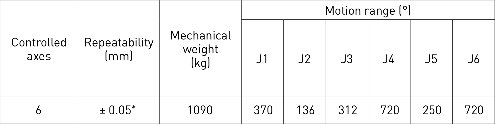
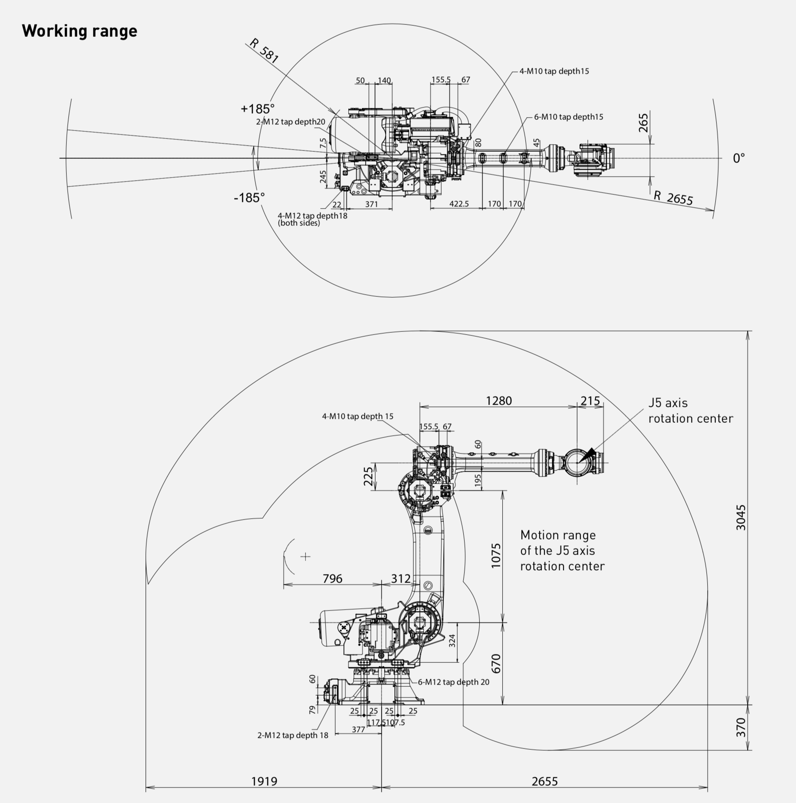
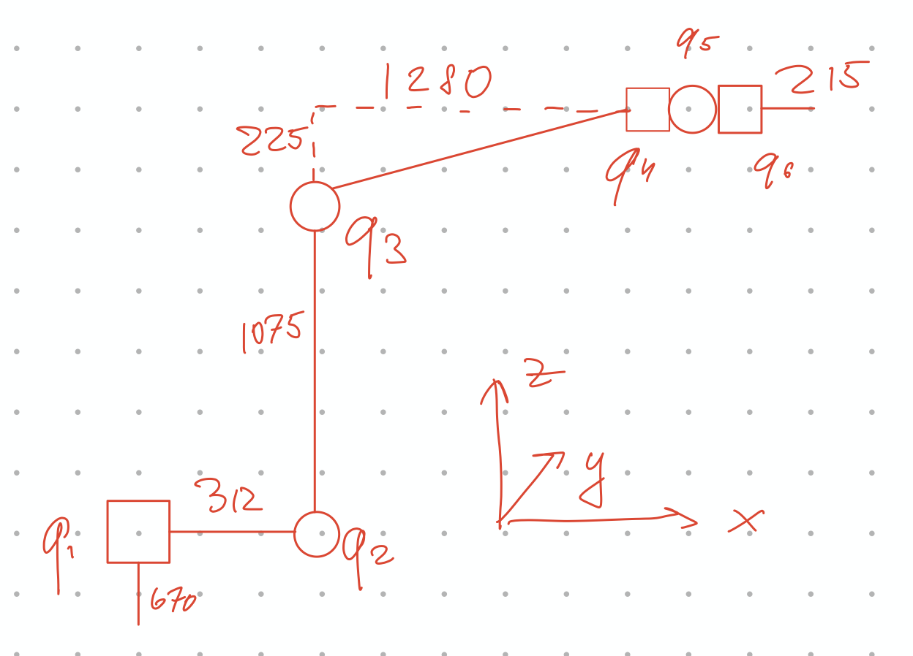

# FoR Homework 1

**Nikita Smirnov BS18-RO**

## Description of the robot:

6 d.o.f

## Kinematic Scheme

5 links (in schematic representation). Near each link (including 2 real links ) depicted their size.

6 joints. Last 3 joint can be represented as prizmatic joint or wrist.

## Formuals of FK

$$
\begin{bmatrix}
c2c3 && c2s3 && -s2 && x \\
c3s1s2 - c1s3 && c1c3 + s1s2s3 && c2s1 && y \\
c1c3s2 + s1s3 && -c3s1 + c1s2s3 && c1c2 && z \\
0 && 0&& 0&& 1
\end{bmatrix} = T^0_6
$$

3 angles (a1, a2, a3) and 3 coordinates (x, y, z).

To find angles:
$$
a_1 = atan2(T_{23}, T_{33})\ if\ c2\ne 0 \\
a_2 = atan2(-T_{13}, T_{11}|T_{12}) \\
a_3 = atan2(T_{12}, T_{11}) \ if\ c2\ne 0 
$$
Way to find coordinates is obvious

## IK explanation

$$
\left[Tz(670)^{-1}\times T\times Tx^{-1}(215)\right][1:3, 4] = T_{123}[1:3, 4]
$$

Using this we find q1, q2, q3 using geometrical method.
$$
T_{123}^{-1}Tz(670)^{-1}\times T\times Tx^{-1}(215) = T_{456}
$$
$$
T_{456} = \left(
\begin{array}{cccc}
 \text{c5} & \text{s5} \text{s6} & -\text{c6} \text{s5} & 0 \\
 \text{s4} \text{s5} & \text{c4} \text{c6}-\text{c5} \text{s4} \text{s6} & \text{c4}
   \text{s6}+\text{c5} \text{c6} \text{s4} & 0 \\
 \text{c4} \text{s5} & -\text{c4} \text{c5} \text{s6}-\text{c6} \text{s4} & \text{c4}
   \text{c5} \text{c6}-\text{s4} \text{s6} & 0 \\
 0 & 0 & 0 & 1 \\
\end{array}
\right)
$$

Knowing this, I've applied algo similar to finding FK.

## Github

https://github.com/pakrentos/for-hw-1

